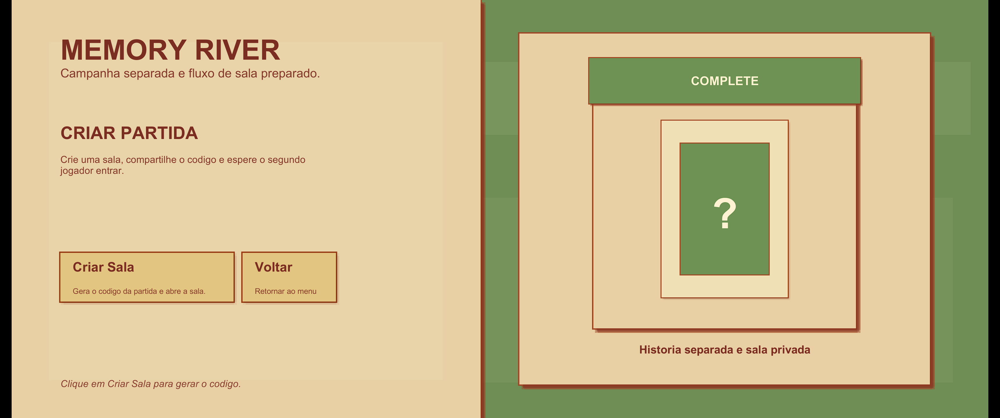

# Memory River

Projeto academico de um jogo da memoria com tema ambiental, desenvolvido em Unity. Este documento foi escrito como material de handoff tecnico, para que outra pessoa consiga entender a estrutura do projeto, testar o sistema e continuar a implementacao sem precisar descobrir tudo do zero.

## Midia do Projeto

### Video de demonstracao

- YouTube: https://youtu.be/NdFcX2iyQd0

O video mostra:
- navegacao no menu principal;
- fluxo do modo historia;
- fluxo de criar sala e entrar em sala;
- partida online em funcionamento;
- tela final de vitoria e derrota.

### Galeria de telas

#### Figura 1. Menu principal


Legenda:
- tela inicial do jogo;
- apresenta os fluxos `Modo Historia`, `Criar Partida`, `Encontrar Partida` e `Sair`.

#### Figura 2. Menu do modo historia


Legenda:
- tela intermediaria da campanha;
- permite iniciar o `Capitulo 1` e retornar ao menu principal.

#### Figura 3. Criar partida antes de gerar o codigo



Legenda:
- painel online antes da criacao da sala;
- o codigo ainda nao foi gerado;
- o jogador precisa clicar em `Criar Sala`.

#### Figura 4. Criar partida depois de gerar o codigo


Legenda:
- painel online depois da criacao da sala;
- o codigo de entrada fica visivel para ser compartilhado com o segundo jogador.

#### Figura 5. Encontrar partida


Legenda:
- tela em que o segundo jogador informa o codigo da sala;
- usada para entrar na partida criada pelo host.

#### Figura 6. Gameplay


Legenda:
- tela principal da partida;
- mostra o tabuleiro, o HUD de pontos e o estado da sala durante a rodada.

#### Figura 7. Tela de vitoria


Legenda:
- resultado exibido ao jogador vencedor;
- mostra pontuacao final e botoes de acao.

#### Figura 8. Tela de derrota


Legenda:
- resultado exibido ao jogador derrotado;
- apresenta a diferenca de pontuacao e opcoes de continuar ou voltar.

## 1. Visao Geral

O projeto possui dois fluxos principais:

- `Modo Historia`: experiencia local com menu de campanha.
- `Modo Online`: criacao e entrada em sala, seguida de uma partida sincronizada entre dois jogadores.

O jogo usa uma arquitetura hibrida:

- `TCP`: gerenciamento de sala e sessao da partida.
- `Unity Relay + Unity Transport + Netcode for GameObjects`: gameplay em tempo real.

Isso significa que:

- o TCP cuida do lobby;
- o Relay/Netcode cuida da partida em si;
- cartas, turnos, pontuacao e fim de jogo continuam no stack nativo da Unity.

## 2. Objetivo do Projeto

O objetivo do projeto e unir:

- mecanica de jogo da memoria;
- tema ambiental/educativo;
- menus separados para campanha e online;
- multiplayer para dois jogadores;
- base documentada para expansao futura.

## 3. Tecnologias Utilizadas

- `Unity 2022.3.62f3`
- `C#`
- `Unity Netcode for GameObjects 1.5.1`
- `Unity Transport 1.3.4`
- `Unity Services Authentication 2.0.0`
- `Unity Services Relay 1.0.2`
- `Unity Services Core 1.14.0`
- `TextMeshPro`
- `TCP` com mensagens JSON simples
- `Servidor TCP em C# console`

## 4. Estrutura Geral do Projeto

Principais pastas:

- `Assets/Scenes`: cenas do jogo
- `Assets/Scripts`: scripts principais de gameplay e menus
- `Assets/Scripts/TcpLobby`: cliente TCP e modelos do lobby
- `Assets/Editor`: scripts utilitarios para gerar e corrigir cenas
- `TcpServer`: servidor TCP do lobby
- `Assets/Media`, `Assets/Objects`, `Assets/Resources`, `Assets/Som`: artes, prefabs, sprites e audio
- `docs/media`: imagens e video referenciados no README

## 5. Cenas do Projeto

### `MainMenu.unity`

Cena inicial do jogo. Possui as opcoes:

- `Modo Historia`
- `Criar Partida`
- `Encontrar Partida`
- `Sair`

### `StoryMenu.unity`

Cena intermediaria da campanha. Hoje o fluxo esta preparado para o `Capitulo 1`.

### `Level3_Multiplayer.unity`

Cena principal de gameplay. Apesar do nome antigo, ela e usada tanto para:

- modo historia/local;
- modo online.

## 6. Fluxo de Navegacao

### Fluxo local

`MainMenu -> StoryMenu -> Level3_Multiplayer`

### Fluxo online

`MainMenu -> Criar Partida / Encontrar Partida -> Sala TCP valida -> Relay -> Level3_Multiplayer`

## 7. Arquitetura do Online

### 7.1 Lobby TCP

O lobby usa um servidor TCP separado para:

- criar sala;
- entrar em sala;
- manter host e guest;
- marcar jogadores como prontos;
- avisar quando ambos estao prontos;
- repassar o `relayJoinCode` do host para o segundo jogador;
- tratar saida da sala.

### 7.2 Gameplay com Relay/Netcode

Depois que a sala TCP fica valida:

1. o host cria a sessao Relay;
2. o host recebe um `join code`;
3. esse codigo e enviado ao guest pelo TCP;
4. os dois entram na cena da partida;
5. a logica do tabuleiro continua no `RelayMatchController`.

Importante:

- o TCP nao sincroniza cartas;
- o TCP nao controla turnos;
- o TCP nao substitui o Netcode;
- o TCP e apenas a camada de sala/sessao.

### 7.3 Como o TCP foi usado neste projeto

Neste projeto, o TCP foi adicionado como uma camada separada do gameplay principal. A ideia foi nao alterar a arquitetura da partida que ja funcionava com os servicos da Unity.

Na pratica, o TCP ficou responsavel apenas por:

- conectar o cliente Unity a um servidor por `IP + porta`;
- criar a sala;
- gerar e armazenar o codigo da sala;
- permitir que outro jogador entre por esse codigo;
- manter o estado da sala em memoria no servidor;
- marcar host e guest;
- controlar se cada jogador esta pronto ou nao;
- avisar quando ambos estiverem prontos;
- liberar o inicio da partida;
- repassar o `Relay Join Code` do host para o segundo jogador;
- tratar saida e desconexao da sala.

Ou seja, o TCP foi usado como um **modulo de lobby e sessao**.

O TCP **nao** foi usado para:

- sincronizar cartas;
- sincronizar turnos;
- sincronizar objetos da partida;
- mover dados do tabuleiro em tempo real;
- decidir vencedor durante o gameplay.

Essas responsabilidades continuaram no stack principal da Unity:

- `Unity Relay`
- `Unity Transport`
- `Netcode for GameObjects`
- `RelayMatchController`

#### Fluxo pratico do TCP no projeto

O fluxo final ficou assim:

1. O jogador abre o jogo.
2. O cliente Unity conecta no servidor TCP.
3. O host usa `Criar Partida`.
4. O servidor TCP cria a sala e devolve um codigo.
5. O segundo jogador usa `Encontrar Partida`.
6. O servidor coloca os dois na mesma sala.
7. Os dois podem marcar que estao prontos.
8. Quando a sala fica valida, o host inicia o fluxo do Relay.
9. O host cria a sessao no Relay.
10. O host recebe o `join code` do Relay.
11. Esse `join code` e enviado ao outro jogador pelo servidor TCP.
12. A partir desse ponto, a partida continua no sistema online principal da Unity.

#### Vantagem dessa decisao

Essa separacao trouxe uma vantagem importante para o projeto academico:

- o lobby ficou simples de entender e expandir;
- a partida nao precisou ser reescrita;
- o fluxo de sala ficou isolado;
- quem continuar o projeto consegue mexer no lobby sem quebrar o gameplay online.

## 8. Explicacao de Cada Classe

Esta e a parte mais importante para continuidade do trabalho.

### `Assets/Scripts/Card.cs`

Responsavel pelo comportamento individual de cada carta.

Funcoes principais:

- armazenar sprite da frente e do verso;
- armazenar valor da carta;
- controlar se a carta ja foi inicializada;
- controlar se a carta ja foi acertada;
- executar animacoes de:
  - aparecer;
  - virar;
  - desaparecer;
- aplicar estados visuais recebidos do modo online.

Observacao:
- a classe nao decide as regras da partida;
- ela representa e anima uma carta.

### `Assets/MemoryCardButton.cs`

Componente auxiliar ligado ao clique da carta.

Funcao:

- receber o clique do botao da carta;
- chamar `GameManager.OnCardClicked(cardIndex)`.

### `Assets/Scripts/GameManager.cs`

Controlador principal do gameplay.

Responsabilidades:

- gerar cartas automaticamente a partir de prefab;
- montar o tabuleiro;
- iniciar o preview inicial das cartas;
- processar cliques locais;
- comparar pares no modo local;
- tocar sons;
- esconder cartas acertadas;
- criar e atualizar elementos visuais do modo online;
- aplicar snapshots sincronizados vindos do `RelayMatchController`;
- exibir HUD de pontos, mensagens e tela final.

Esta e a classe central da cena de jogo.

### `Assets/Scripts/RelayMatchController.cs`

Classe central do multiplayer da partida.

Responsabilidades:

- inicializar Unity Services;
- autenticar o jogador;
- criar partida no Relay;
- entrar em partida usando codigo do Relay;
- configurar `NetworkManager` e `UnityTransport`;
- manter o estado autoritativo do tabuleiro;
- receber pedidos de jogada;
- validar jogadas;
- controlar turno;
- calcular pontos;
- calcular combo de acertos;
- definir vencedor;
- sincronizar estado da partida com os dois clientes;
- tratar retorno ao menu e revanche.

Resumo:
- no online, essa classe e a autoridade da partida.

### `Assets/Scripts/TcpLobby/TcpLobbyClient.cs`

Cliente TCP de baixo nivel no Unity.

Responsabilidades:

- conectar em um IP e porta;
- enviar mensagens JSON para o servidor;
- receber mensagens JSON do servidor;
- expor eventos de conexao, desconexao, logs e mensagens recebidas.

### `Assets/Scripts/TcpLobby/TcpLobbyManager.cs`

Controlador de lobby TCP no Unity.

Responsabilidades:

- chamar criacao de sala;
- chamar entrada em sala;
- alternar estado de pronto;
- receber atualizacoes da sala;
- repassar status para a UI;
- iniciar o fluxo do Relay quando ambos estiverem prontos.

Em resumo:
- essa classe faz a ponte entre o menu e o servidor TCP.

### `Assets/Scripts/TcpLobby/LobbyMessage.cs`

Modelo de mensagem JSON usado pelo cliente TCP.

Funcoes:

- representar os tipos de mensagem do lobby;
- serializar e desserializar dados simples de sala.

### `Assets/Scripts/TcpLobby/RoomState.cs`

Modelo do estado da sala no cliente Unity.

Armazena:

- codigo da sala;
- host;
- guest;
- status;
- flags de pronto;
- join code do Relay quando necessario.

### `TcpServer/Program.cs`

Servidor TCP em C# console.

Responsabilidades:

- abrir porta TCP;
- aceitar conexoes;
- criar salas;
- permitir entrada por codigo;
- marcar jogadores prontos;
- manter o estado das salas em memoria;
- enviar mensagens claras de sucesso e erro;
- repassar `relayJoinCode` do host para o guest;
- tratar desconexao e saida da sala.

### `TcpServer/LobbyMessage.cs`

Modelo de mensagem JSON usado pelo servidor.

### `TcpServer/RoomState.cs`

Modelo de estado de sala usado pelo servidor.

### `Assets/Scripts/GameLaunchConfig.cs`

Classe estatica usada para carregar configuracoes de uma cena para outra.

Armazena, por exemplo:

- modo de jogo atual;
- codigo da sala;
- capitulo da campanha;
- mensagens pendentes de status.

### `Assets/Scripts/MainMenuController.cs`

Controla o menu principal.

Responsabilidades:

- ligar botoes por nome;
- abrir painel principal;
- abrir painel de criar partida;
- abrir painel de encontrar partida;
- chamar criacao de sala;
- chamar entrada em sala;
- esconder e mostrar informacoes corretas;
- garantir que o codigo da sala so apareca quando deve;
- navegar para modo historia;
- sair do jogo;
- integrar com `TcpLobbyManager` quando o lobby TCP estiver ativo.

### `Assets/Scripts/StoryMenuController.cs`

Controla o menu do modo historia.

Responsabilidades:

- configurar o texto do capitulo;
- ligar botoes `Jogar Capitulo 1` e `Voltar`;
- entrar na cena de gameplay em modo historia.

### `Assets/Scripts/SceneIds.cs`

Classe simples de constantes.

Serve para centralizar os nomes das cenas:

- `MainMenu`
- `StoryMenu`
- `Gameplay`

### `Assets/Scripts/MusicPlayer.cs`

Controla a musica persistente entre cenas.

Responsabilidade:

- impedir varias instancias ao trocar de cena;
- manter uma unica instancia com `DontDestroyOnLoad`.

### `Assets/Scripts/EducationalInfo.cs`

Classe de apoio para mensagens educativas e feedback visual.

Funcoes:

- mostrar mensagem de sucesso;
- mostrar mensagem de erro;
- esconder mensagem.

### `Assets/Editor/MainMenuSceneBuilder.cs`

Script de editor.

Responsabilidades:

- gerar ou atualizar a cena `MainMenu.unity`;
- montar layout base do menu;
- aplicar estilo visual;
- organizar botoes, paineis e decoracao.

### `Assets/Editor/StoryMenuSceneBuilder.cs`

Script de editor da cena `StoryMenu`.

Responsabilidades:

- gerar ou atualizar a cena `StoryMenu.unity`;
- construir o layout base do menu de campanha;
- organizar paineis, textos e botoes.

### `Assets/Editor/MissingScriptCleaner.cs`

Ferramenta de manutencao.

Responsabilidades:

- procurar scripts faltando em cenas e prefabs;
- remover referencias quebradas;
- evitar warnings desnecessarios no editor.

## 9. Estado Atual do Projeto

No momento, o projeto possui:

- menu principal funcional;
- menu de historia funcional;
- gameplay local funcionando;
- gameplay online implementado com Relay/Netcode;
- lobby TCP implementado para criacao e entrada em sala;
- sistema de pontos;
- sistema de combo de acertos;
- tela final com resultado da partida;
- animacoes de carta;
- README com midia e documentacao de handoff.

## 10. Testes Realizados

O projeto foi testado nos seguintes cenarios:

- abertura e navegacao do `MainMenu`;
- navegacao `MainMenu -> StoryMenu -> Level3_Multiplayer`;
- criacao de sala online;
- entrada do segundo jogador por codigo;
- inicio de partida online entre dois jogadores;
- sincronizacao de cartas, turnos e pontuacao;
- exibicao correta de tela de vitoria e derrota;
- build Android e execucao em aparelho Android;
- execucao local no editor Unity 2022.

## 11. Como Abrir e Executar

### Requisitos

- Unity `2022.3.62f3`
- .NET SDK no computador caso seja necessario rodar o `TcpServer`

### Abrir no editor

1. Abrir o projeto no Unity Hub.
2. Abrir a cena `Assets/Scenes/MainMenu.unity`.
3. Apertar `Play`.

### Rodar o servidor TCP

No terminal:

```powershell
cd "TcpServer"
dotnet run
```

Se quiser alterar a porta:

```powershell
dotnet run -- 7777
```

### Testar o online

1. Iniciar o servidor TCP.
2. Abrir dois clientes:
   - Unity Editor + build;
   - ou dois builds.
3. No cliente 1:
   - `Criar Partida`
   - `Criar Sala`
4. No cliente 2:
   - `Encontrar Partida`
   - digitar o codigo gerado
5. Os dois entram na sala.
6. Quando o fluxo de Relay for iniciado, os dois vao para `Level3_Multiplayer`.

### Testar no Android

1. Selecionar plataforma Android no `Build Settings`.
2. Marcar arquitetura `ARM64`.
3. Gerar o `.apk`.
4. Instalar no dispositivo Android ou usar `Build And Run`.

## 12. Possivel Erro no Build Windows

Se o executavel mostrar erro relacionado a `VCRUNTIME140.dll`, o computador provavelmente esta sem o runtime do Visual C++ necessario para executar o build.

Solucao:

1. Instalar o `Microsoft Visual C++ Redistributable` mais recente.
2. Abrir o jogo novamente.

## 13. O Que Outra Pessoa Precisa Saber Para Continuar

Se outra pessoa for continuar o trabalho, a recomendacao e seguir esta ordem:

1. estudar `GameManager.cs`;
2. estudar `RelayMatchController.cs`;
3. estudar `TcpLobbyManager.cs` e `TcpLobbyClient.cs`;
4. estudar `MainMenuController.cs` e `StoryMenuController.cs`;
5. revisar as cenas em `Assets/Scenes`;
6. revisar os builders de menu em `Assets/Editor`;
7. revisar o servidor em `TcpServer`.

### Pontos naturais para evolucao

- melhorar o HUD do gameplay;
- melhorar feedback visual de pontos e combos;
- adicionar mais capitulos no modo historia;
- adicionar mais conteudo educativo;
- refinar ainda mais as telas de vitoria/derrota;
- organizar melhor prefabs e assets visuais;
- revisar nomes antigos, como `Level3_Multiplayer`.

## 14. Observacoes Importantes

- O projeto passou por migracao de uma versao antiga da Unity para `Unity 2022`.
- O multiplayer da partida continua usando o stack da Unity.
- O lobby TCP e complementar e nao substitui o Relay/Netcode.
- Existem nomes antigos em algumas cenas e estruturas, mas o fluxo principal atual esta funcional.
- Este README foi escrito com foco academico e de continuidade tecnica.

## 15. Resumo Final

Este projeto ja entrega:

- estrutura de menus;
- gameplay de jogo da memoria;
- campanha inicial;
- multiplayer online;
- lobby TCP para sala;
- sincronizacao de estado da partida;
- base para expansao futura.

Para uma continuacao segura do trabalho:

- manter `GameManager` e `RelayMatchController` como referencias centrais do gameplay;
- manter `TcpLobbyManager` e `TcpServer` como referencias centrais do lobby;
- documentar novas mudancas conforme forem sendo feitas;
- evitar duplicar logica entre modo historia, lobby e gameplay online.
